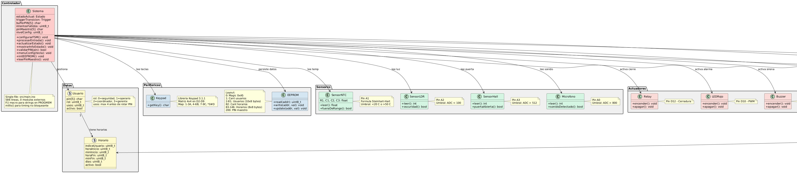
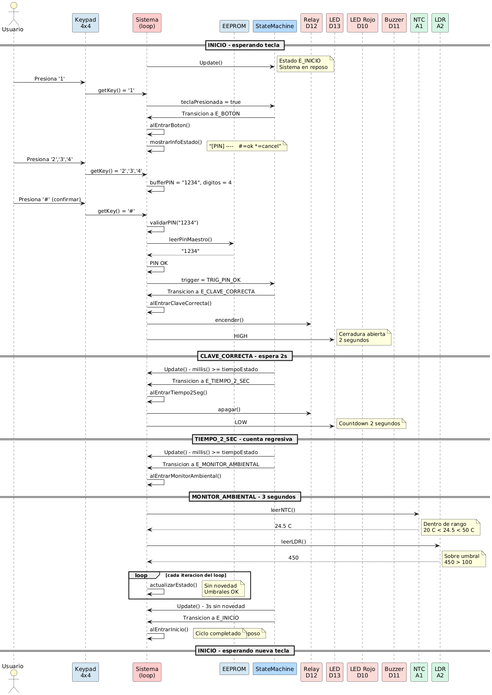
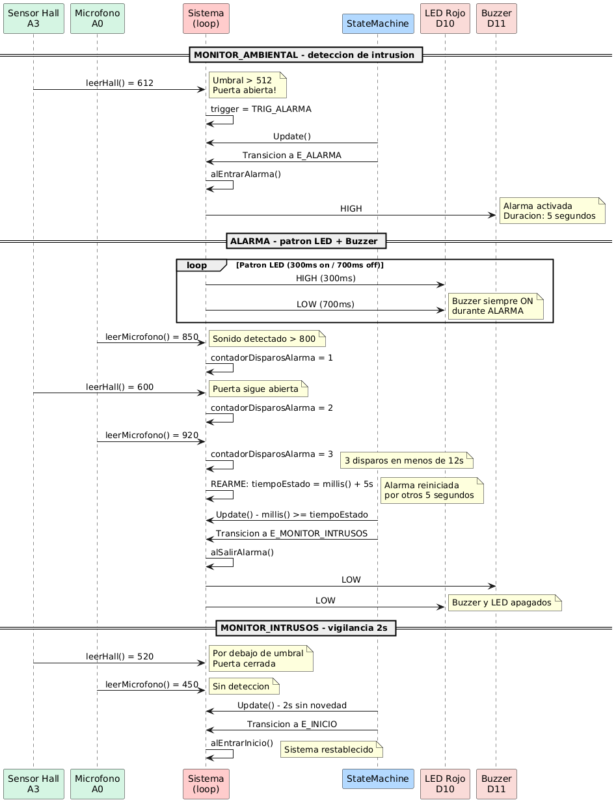
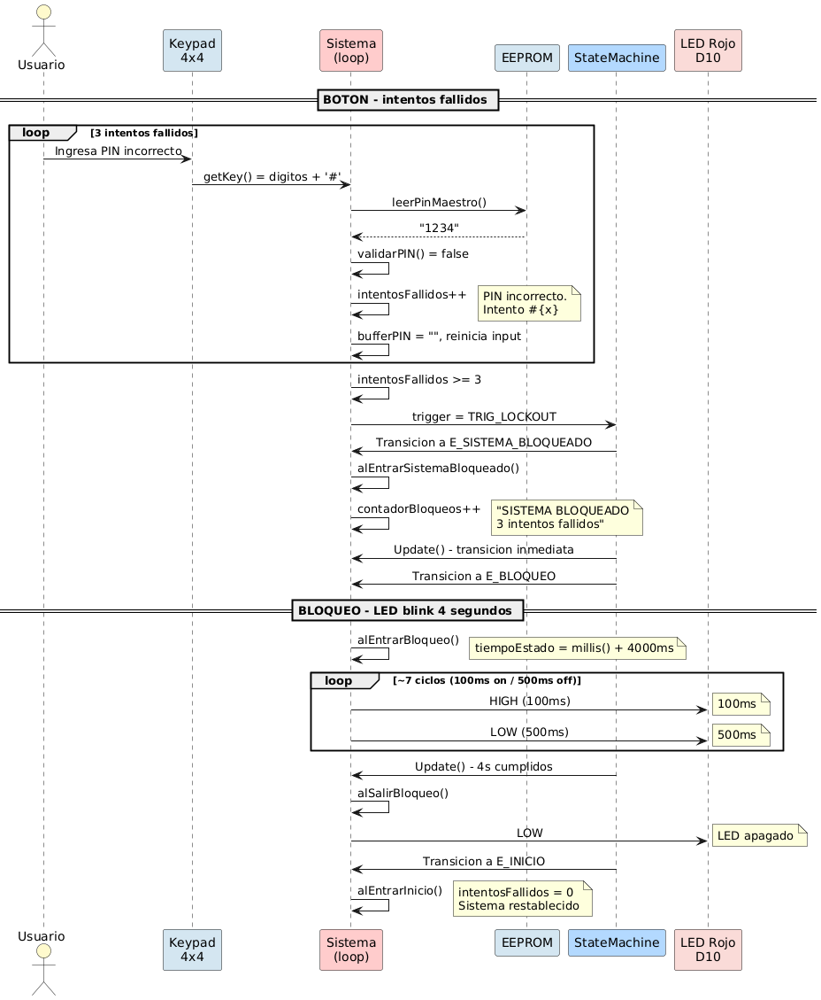
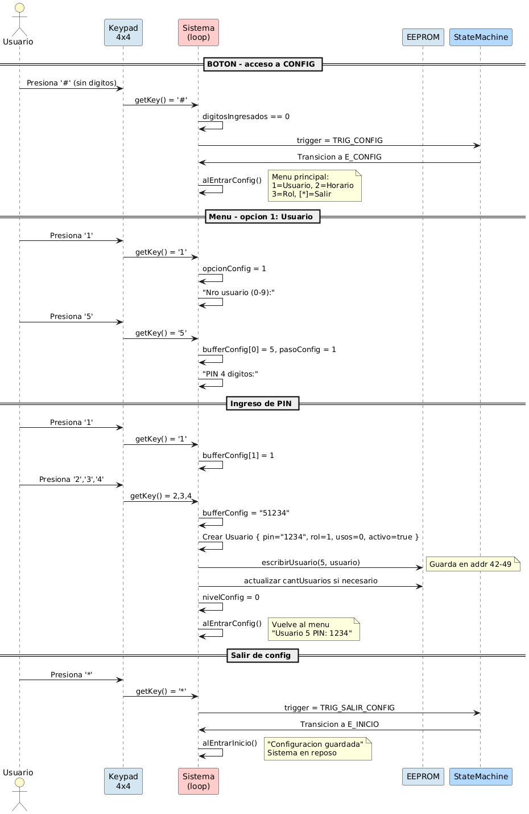

# Control de Acceso y Seguridad

> **Arquitectura Computacional** — Arduino Uno (ATmega328P)
> Proyecto académico: sistema de control de acceso con cerradura inteligente,
> monitoreo ambiental y detección de intrusiones.

---

## 📋 Resumen del Sistema

El sistema implementa una máquina de estados finitos (FSM) de 10 estados que
gestiona el ingreso mediante teclado numérico 4×4, valida credenciales
almacenadas en EEPROM, controla un cierre eléctrico, detecta intrusiones
mediante sensores de puerta y sonido, activa alarmas audiovisuales y monitorea
condiciones ambientales.

**Especificaciones técnicas:**

| Parámetro | Valor |
|-----------|-------|
| Microcontrolador | ATmega328P (Arduino Uno) |
| Frecuencia | 16 MHz |
| SRAM | 2 KB (487 B usados — 23.8%) |
| Flash | 32 KB (13.4 KB usados — 41.6%) |
| EEPROM | 1 KB (147 B usados — 14.4%) |
| Lenguaje | C++ (Arduino framework) |
| Librerías | StateMachineLib, Keypad 3.1.1, EEPROM |
| Archivos | 1 (`src/main.ino`, 586 líneas) |

---

## 🏗️ Arquitectura del Sistema

### Diagrama de Clases

El siguiente diagrama muestra la estructura completa del sistema: datos,
máquina de estados, periféricos, sensores, actuadores y el controlador central.

| Clases del Sistema |
|--------------------|
|  |

**Leyenda de paquetes:**
| Color | Significado |
|-------|-------------|
| 🟡 Amarillo `#FFFACD` | Estructuras de datos (Usuario, Horario) |
| 🔵 Azul `#B3D9FF` | Máquina de estados (Estado, Trigger, StateMachine) |
| 🔷 Celeste `#D4E6F1` | Periféricos (Keypad, EEPROM) |
| 🟢 Verde `#D5F5E3` | Sensores (NTC, LDR, Hall, Micrófono) |
| 🔴 Rosa `#FADBD8` | Actuadores (Relay, LED, Buzzer) |
| 🟥 Rojo `#FFCCCC` | Controlador central (Sistema) |

---

## ⚙️ Máquina de Estados Finitos (FSM)

La FSM es el núcleo arquitectónico del sistema. Implementa 10 estados y
18 transiciones usando la librería `StateMachineLib`.

### Estados

| # | Estado | Descripción | Timing |
|---|--------|-------------|--------|
| 1 | `E_INICIO` | Reposo. Espera tecla del keypad. | — |
| 2 | `E_BOTON` | Ingreso de PIN (4 dígitos enmascarados). | timeout 10s |
| 3 | `E_CLAVE_CORRECTA` | PIN válido. Cerradura abierta. | 2s |
| 4 | `E_CONFIG` | Menú EEPROM: usuarios/horarios/roles. | — |
| 5 | `E_TIEMPO_2_SEC` | Countdown post-desbloqueo. | 2s |
| 6 | `E_MONITOR_AMBIENTAL` | Monitoreo temperatura + luz. | 3s |
| 7 | `E_SISTEMA_BLOQUEADO` | 3 intentos fallidos. | inmediato |
| 8 | `E_BLOQUEO` | LED rojo intermitente (100/500ms). | 4s |
| 9 | `E_ALARMA` | Buzzer + LED rojo (300/700ms). | 5s + rearme |
| 10 | `E_MONITOR_INTRUSOS` | Vigilancia hall + micrófono. | 2s |

### Transiciones Principales

```
INICIO --(tecla)--> BOTON
BOTON --(# sin digitos)--> CONFIG
BOTON --(PIN ok)--> CLAVE_CORRECTA --(2s)--> TIEMPO_2_SEC --(2s)--> MONITOR_AMBIENTAL
BOTON --(3 fallos)--> SISTEMA_BLOQUEADO --> BLOQUEO --(4s)--> INICIO
BOTON --(* o timeout 10s)--> INICIO
MONITOR_AMBIENTAL --(umbral temp/luz)--> ALARMA --(5s)--> MONITOR_INTRUSOS
MONITOR_AMBIENTAL --(3s sin novedad)--> INICIO
MONITOR_INTRUSOS --(hall o mic)--> ALARMA (triple rearme en 12s)
MONITOR_INTRUSOS --(2s sin novedad)--> INICIO
CONFIG --(*)--> INICIO
```

---

## 🖼️ Diagramas de Secuencia

### Ingreso Exitoso (Happy Path)

PIN correcto → desbloqueo de cerradura → monitoreo ambiental → retorno a reposo.

| Secuencia de Ingreso |
|----------------------|
|  |

**Flujo:**
1. El usuario presiona teclas → se almacenan en `bufferPIN[]`
2. Confirma con `#` → se valida contra `pinMaestro` en EEPROM
3. PIN OK → transición a `E_CLAVE_CORRECTA` → relay activado 2s
4. Transición a `E_TIEMPO_2_SEC` → relay desactivado, countdown 2s
5. Transición a `E_MONITOR_AMBIENTAL` → lectura NTC + LDR por 3s
6. Sin umbrales violados → retorno a `E_INICIO`

---

### Intrusión y Alarma

Sensor Hall o micrófono → activación de alarma → monitoreo de intrusos → rearme triple.

| Secuencia de Alarma |
|---------------------|
|  |

**Flujo:**
1. `leerHall()` > 512 (puerta abierta) o `leerMicrofono()` > 800
2. Transición a `E_ALARMA` → buzzer ON + LED rojo parpadea (300/700ms)
3. Cada nueva detección incrementa `contadorDisparosAlarma`
4. Si llega a 3 dentro de 12s (`T_TRIPLE`) → rearme por 5s más
5. Sin más detecciones → transición a `E_MONITOR_INTRUSOS` por 2s
6. Sin novedad → retorno a `E_INICIO`

---

### Bloqueo por Intentos Fallidos

3 PIN incorrectos → bloqueo temporal con LED intermitente.

| Secuencia de Bloqueo |
|----------------------|
|  |

**Flujo:**
1. Cada PIN incorrecto incrementa `intentosFallidos`
2. Al llegar a 3 → transición a `E_SISTEMA_BLOQUEADO` (inmediato)
3. Transición inmediata a `E_BLOQUEO` → LED rojo parpadea (100/500ms) por 4s
4. Pasados 4s → retorno a `E_INICIO` con `intentosFallidos = 0`

---

### Configuración de Usuario (Menú CONFIG)

Acceso al menú EEPROM para alta de usuarios, horarios y roles.

| Secuencia de Configuración |
|----------------------------|
|  |

**Flujo:**
1. Desde `E_BOTON`, presionar `#` sin dígitos → `E_CONFIG`
2. Menú: `1`=Usuario, `2`=Horario, `3`=Rol, `*`=Salir
3. Opción 1: seleccionar índice de usuario (0-9), ingresar PIN 4 dígitos
4. Guarda en EEPROM en `DIR_USUARIOS + idx * 8`
5. `*` para salir → retorno a `E_INICIO`

---

## 🧠 Estructura del Código

`src/main.ino` está organizado en secciones en este orden:

| Sección | Líneas | Contenido |
|---------|--------|-----------|
| Header | 1-20 | Comentarios, descripción, diagrama de transiciones |
| Includes | 22-31 | Librerías: Arduino, StateMachineLib, EEPROM, Keypad, LCD (opcional) |
| Pines | 33-46 | Asignación de pines (D2-D13, A0-A5) |
| Constantes | 48-64 | Timing, umbrales, constantes físicas (Steinhart-Hart) |
| Estructuras | 66-77 | `Usuario`, `Horario` |
| EEPROM Layout | 79-88 | Direcciones de memoria persistente |
| Enumeraciones | 90-98 | `Estado` (10), `Trigger` (8) |
| Variables Globales | 100-140 | Estado, buffer, contadores, sensores |
| Funciones Sensores | 142-153 | `leerNTC()`, `leerLDR()`, `leerHall()`, `leerMicrofono()` |
| Funciones Actuadores | 155-159 | `encenderRele()`, `activarLEDAlarma()`, `activarBuzzer()` |
| Funciones EEPROM | 161-197 | `initEEPROM()`, `leerUsuario()`, `escribirUsuario()`, etc. |
| Validación PIN | 199-227 | `validarPIN()` con rotación tras 4 usos |
| Display | 229-288 | `mostrarInfoEstado()` por Serial + LCD opcional |
| Handlers FSM | 290-426 | `alEntrar*()` y `alSalir*()` para cada estado |
| Entrada | 428-463 | `procesarEntrada()` — lectura de keypad + lógica por estado |
| Menú Config | 465-528 | `menuConfig()` — 3 opciones con sub-pasos |
| Actualización | 530-559 | `actualizarEstado()` — blink patterns + sensores activos |
| `setup()` | 561-579 | Inicialización de pines, EEPROM, FSM |
| `loop()` | 581-586 | `procesarEntrada()` → `actualizarEstado()` → `fsm.Update()` |

---

## 🔌 Asignación de Pines

| Pin | Función | Tipo | Notas |
|-----|---------|------|-------|
| D2-D5 | Keypad Rows (4×4) | INPUT_PULLUP | Filas del teclado matricial |
| D6-D9 | Keypad Columns | INPUT | Columnas del teclado matricial |
| D10 | LED_ROJO | OUTPUT | PWM, patrón de alarma/bloqueo |
| D11 | BUZZER | OUTPUT | Piezo, alarma sonora |
| D12 | LOCK_RELAY | OUTPUT | Control de cerradura eléctrica |
| D13 | LED_BUILTIN | OUTPUT | Indicador de cerradura activa |
| A0 | MICROFONO | INPUT | Sensor de sonido analógico |
| A1 | NTC_TERMISTOR | INPUT | Temperatura (Steinhart-Hart) |
| A2 | LDR | INPUT | Nivel de luz |
| A3 | HALL | INPUT | Sensor magnético de puerta |
| A4-A5 | I2C (LCD opcional) | — | SDA/SCL para LCD 16×2 |

### Mapa del Teclado 4×4

```
┌───┬───┬───┬───┐
│ 1 │ 2 │ 3 │ A │
├───┼───┼───┼───┤
│ 4 │ 5 │ 6 │ B │
├───┼───┼───┼───┤
│ 7 │ 8 │ 9 │ C │
├───┼───┼───┼───┤
│ * │ 0 │ # │ D │
└───┴───┴───┴───┘
```

**Teclas funcionales:**
- `#` — Confirmar PIN / Acceder a CONFIG (sin dígitos)
- `*` — Cancelar / Salir de CONFIG
- `0-9` — Dígitos del PIN

---

## 💾 Layout de EEPROM

| Dirección | Contenido | Tamaño |
|-----------|-----------|--------|
| `0x00` | Magic number (`0xA5`) | 1 byte |
| `0x01` | Cantidad de usuarios | 1 byte |
| `0x02` - `0x51` | Usuarios (10 × 8 bytes) | 80 bytes |
| `0x52` | Cantidad de horarios | 1 byte |
| `0x53` - `0x92` | Horarios (8 × 8 bytes) | 64 bytes |
| `0xC8` | PIN maestro | 4 bytes |

**Estructura de cada usuario (8 bytes):**
```
[PIN 4B][rol 1B][usos 1B][activo 1B][padding 1B]
```

**Estructura de cada horario (8 bytes):**
```
[indiceUsuario 1B][horaInicio 1B][minInicio 1B]
[horaFin 1B][minFin 1B][dias 1B][activo 1B][padding 1B]
```

---

## ⏱️ Constantes de Timing

| Constante | Valor | Propósito |
|-----------|-------|-----------|
| `T_REBOTE` | 50 ms | Debounce de teclado |
| `T_INPUT` | 10 s | Timeout para ingreso de PIN |
| `T_DESBLOQUEO` | 2 s | Duración de cerradura abierta |
| `T_CONTEO` | 2 s | Countdown post-desbloqueo |
| `T_BLOQUEO` | 4 s | Duración de estado bloqueado |
| `T_ALARMA` | 5 s | Duración de alarma |
| `T_INTRUSOS` | 2 s | Ventana de monitoreo de intrusos |
| `T_AMBIENTAL` | 3 s | Ventana de monitoreo ambiental |
| `T_TRIPLE` | 12 s | Ventana para triple rearme de alarma |

### Patrones de Blink (LED Rojo)

| Estado | On | Off | Duración total |
|--------|----|-----|----------------|
| `E_BLOQUEO` | 100 ms | 500 ms | 4 s (~7 ciclos) |
| `E_ALARMA` | 300 ms | 700 ms | 5 s + rearmes |

---

## 📐 Umbrales de Sensores

| Sensor | Pin | Umbral | Lectura Normal | Lectura Alarma |
|--------|-----|--------|----------------|----------------|
| Temperatura baja | A1 | < 20 °C | 20-50 °C | < 20 °C |
| Temperatura alta | A1 | > 50 °C | 20-50 °C | > 50 °C (fuego) |
| Luz (LDR) | A2 | < 100 ADC | ≥ 100 | < 100 |
| Hall (puerta) | A3 | > 512 ADC | ≤ 512 | > 512 (abierta) |
| Micrófono | A0 | > 800 ADC | ≤ 800 | > 800 (sonido) |

---

## 🔒 Seguridad

### Rotación de Claves

Cada usuario tiene un contador `usos` que se incrementa en cada ingreso exitoso.
Al llegar a 4 usos:
1. El contador se reinicia a 0
2. Se genera un nuevo PIN aleatorio de 4 dígitos
3. Se guarda en EEPROM y se muestra por Serial

### Política de Intentos

- Máximo 3 intentos fallidos consecutivos
- Al superarlos: bloqueo de 4 segundos con LED intermitente
- Después del bloqueo: los intentos vuelven a 0

### Roles de Usuario

| Código | Rol | Descripción |
|--------|-----|-------------|
| 0 | Seguridad | Acceso irrestricto |
| 1 | Operario | Acceso en horario laboral |
| 2 | Coordinador | Acceso con ventanas extendidas |
| 3 | Gerente | Acceso irrestricto + gestión de usuarios |

---

## 📦 Dependencias

| Librería | Versión | Fuente | Propósito |
|----------|---------|--------|-----------|
| StateMachineLib | 1.0.0 | Local (`lib/`) | Máquina de estados finitos |
| AsyncTaskLib | 1.0.0 | luisllamasbinaburo | Tareas asíncronas (no usado activamente) |
| Keypad | 3.1.1 | chris--a | Driver para teclado matricial 4×4 |
| EEPROM | built-in | Arduino | Memoria persistente |

---

## 🧪 Compilación y Build

```bash
scripts/build.sh build       # Compilar
scripts/build.sh upload      # Compilar + subir a placa
scripts/build.sh run         # Subir + abrir monitor serie
scripts/build.sh monitor     # Monitor serie (9600 baud)
scripts/build.sh clean       # Limpiar
scripts/build.sh size        # Mostrar uso de memoria
scripts/build.sh deps        # Instalar dependencias
scripts/build.sh full        # clean + deps + build
scripts/build.sh -v build    # Verbose
```

**Uso de memoria actual:**
```
RAM:    487 bytes (23.8%) de 2048
Flash:  13406 bytes (41.6%) de 32256
```

---

## 📁 Archivos del Proyecto

```
Arduino-Project/
├── src/
│   └── main.ino              # Implementación completa (586 líneas)
├── lib/
│   └── StateMachineLib/       # Librería de FSM local
├── spec/
│   ├── ARQ_Proyecto.pptx.pdf  # Spec de la cátedra
│   └── fsm_arqB.drawio.pdf    # Diagrama FSM original
├── docs/
│   ├── examples/              # Sketches de ejemplo de sensores
│   └── UML/                   # Diagramas generados
│       ├── Clases.png
│       ├── IngresoExitoso.png
│       ├── IntrusionAlarma.png
│       ├── BloqueoIntentos.png
│       ├── ConfigUsuario.png
│       ├── clases.puml
│       ├── secuencia-ingreso.puml
│       ├── secuencia-alarma.puml
│       ├── secuencia-bloqueo.puml
│       └── secuencia-config.puml
├── openspec/                  # Artefactos SDD
├── scripts/
│   └── build.sh              # Script de compilación
├── platformio.ini             # Configuración PlatformIO
├── AGENTS.md                  # Instrucciones para agentes AI
└── README.md                  # Este documento
```

---

## 🔄 Ciclo de Vida del Sistema

```
                    ┌──────────┐
                    │  INICIO  │ <──────────────────────────┐
                    └────┬─────┘                            │
                         │ tecla                            │
                         v                                  │
                    ┌──────────┐                            │
              ┌────>│  BOTON   │────┐                       │
              │     └──────────┘    │                       │
              │          │          │                       │
              │     timeout/*       │ 3 fallos              │
              │          │          │                       │
              │          v          v                       │
              │     ┌──────────┐ ┌────────────┐            │
              │     │  INICIO  │ │ SIS. BLOQ. │            │
              │     └──────────┘ └──────┬──────┘            │
              │                         │                   │
              │                         v                   │
              │                    ┌──────────┐             │
              │                    │ BLOQUEO  │── 4s ───────┤
              │                    └──────────┘             │
              │                                             │
              │ PIN ok         # sin digitos                │
              │     │              │                        │
              │     v              v                        │
              │  ┌──────────┐ ┌──────────┐                  │
              │  │ CLAVE OK │ │  CONFIG  │── * ─────────────┤
              │  └────┬─────┘ └──────────┘                  │
              │       │ 2s                                  │
              │       v                                     │
              │  ┌──────────────┐                            │
              │  │ TIEMPO 2 SEC │                            │
              │  └──────┬───────┘                            │
              │         │ 2s/tecla                           │
              │         v                                   │
              │  ┌──────────────────┐                        │
              │  │ MONITOR AMBIENTAL│─── 3s ─────────────────┤
              │  └────────┬─────────┘                        │
              │           │ umbral                           │
              │           v                                  │
              │  ┌──────────┐                                │
              │  │  ALARMA  │─── 5s ─────────────────────────┤
              │  └─────┬────┘                                │
              │        │ triple rearme                       │
              │        v                                     │
              │  ┌──────────────────┐                        │
              │  │ MONITOR INTRUSOS │─── 2s ─────────────────┘
              │  └──────────────────┘
              │           │ intrusion
              │           v
              │     ┌──────────┐
              └─────│  ALARMA  │ (rearme)
                    └──────────┘
```

---

*Documento generado para Arquitectura Computacional — 2026*
