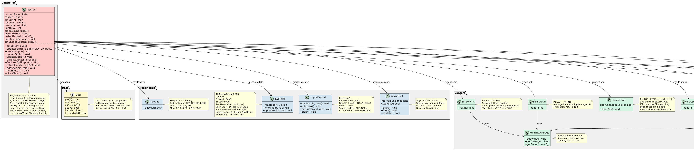
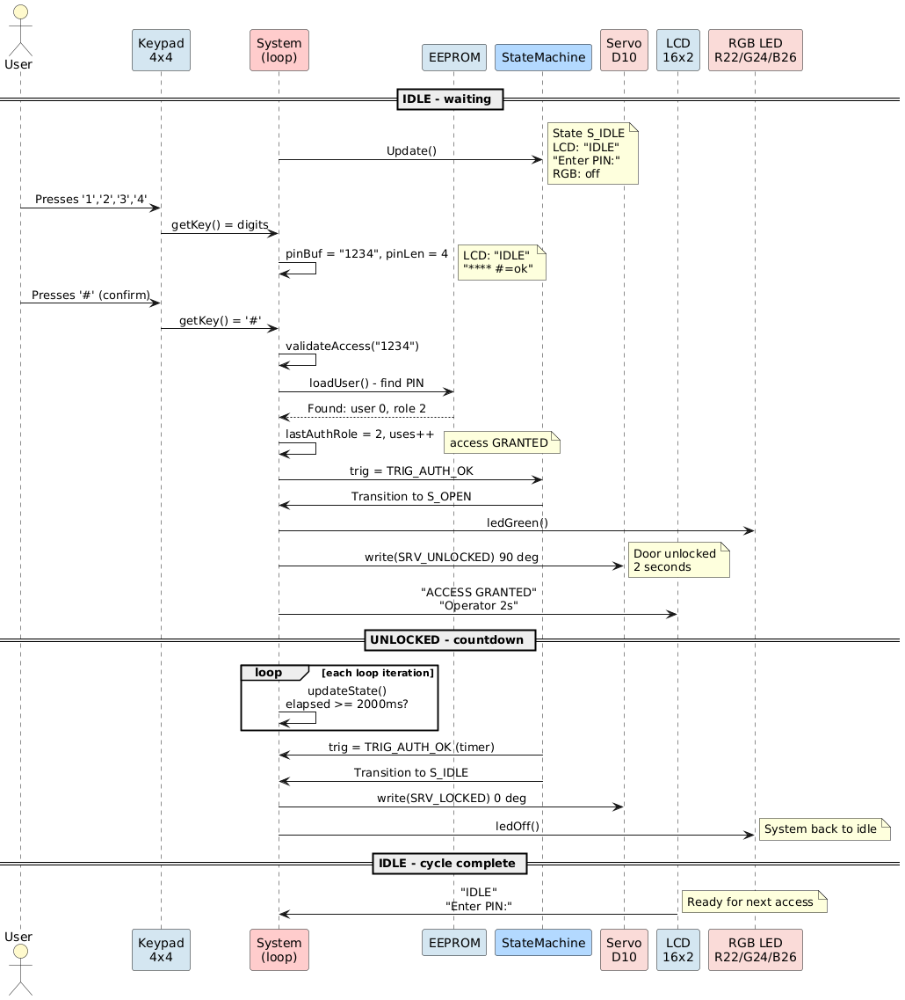
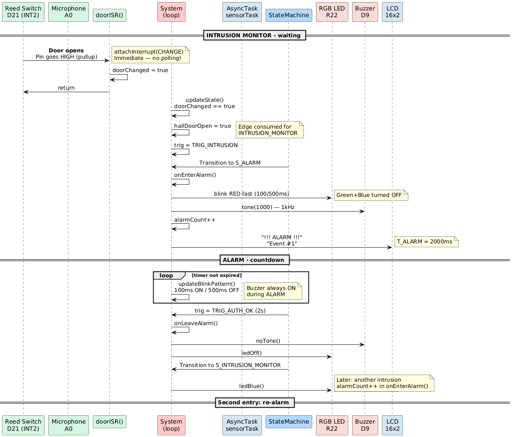
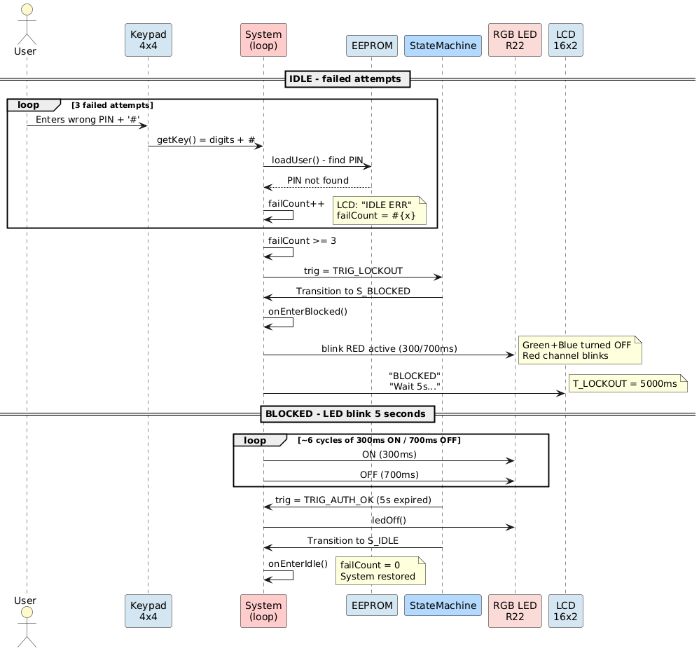
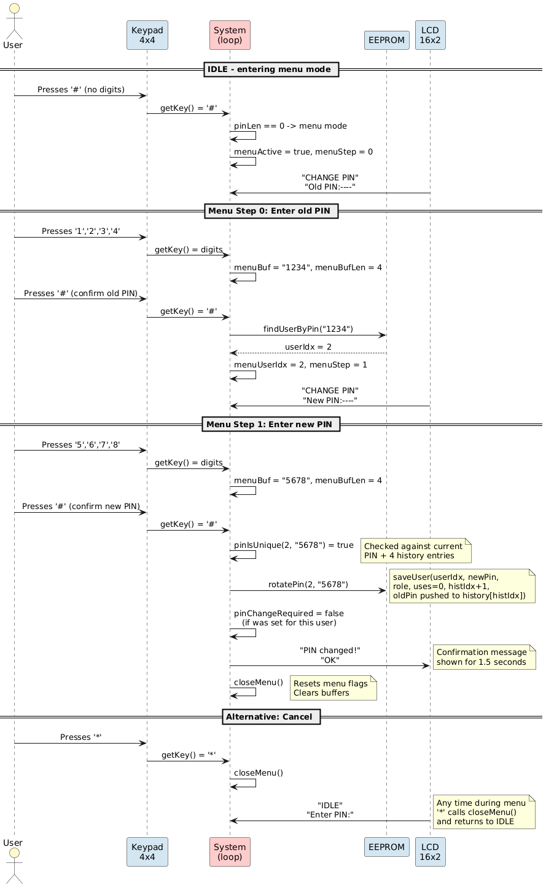

# Access Control and Security System

> **Arquitectura Computacional** — Arduino Mega (ATmega2560)
> Academic project: smart lock access control system with
> environmental monitoring and intrusion detection.

---

## System Overview

The system implements a 6-state Finite State Machine (FSM) that manages
entry via 4x4 numeric keypad, validates credentials stored in EEPROM,
controls a servo-based door lock, detects intrusion via hall and sound
sensors, activates audiovisual alarms, and monitors environmental
conditions (temperature, light) with sensor averaging.

**Technical Specifications:**

| Parameter | Value |
|-----------|-------|
| Microcontroller | ATmega2560 (Arduino Mega) |
| Frequency | 16 MHz |
| SRAM | 8 KB (790 B used — 9.6%) |
| Flash | 248 KB (19.4 KB used — 7.6%) |
| EEPROM | 4 KB |
| Language | C++ (Arduino framework) |
| Libraries | StateMachineLib, AsyncTaskLib, Keypad 3.1.1, Servo, LiquidCrystal, RunningAverage |
| Files | 1 (`src/main.ino`, ~1770 lines) |
| Build toggle | `SIMULATOR_BUILD` (manual FSM for simulators) |

---

## System Architecture

### Class Diagram

The following diagram shows the complete system structure: data,
state machine, peripherals, sensors, actuators, and the central controller.

| System Classes |
|----------------|
|  |

**Package Legend:**
| Color | Meaning |
|-------|---------|
| 🟡 Yellow `#FFFACD` | Data structures (User) |
| 🔵 Blue `#B3D9FF` | State machine (State, Trigger, StateMachine) |
| 🔷 Light Blue `#D4E6F1` | Peripherals (Keypad, EEPROM, LiquidCrystal, AsyncTask) |
| 🟢 Green `#D5F5E3` | Sensors (NTC, LDR, Hall, Microphone) |
| 🔴 Pink `#FADBD8` | Actuators (Servo, LED, Buzzer) |
| 🟥 Red `#FFCCCC` | Central controller (System) |

---

## Finite State Machine (FSM)

The FSM is the architectural core. It implements **6 states** with
**9 transitions** using `StateMachineLib`.

### States

| # | State | Description | Timing |
|---|-------|-------------|--------|
| 1 | `S_IDLE` | Idle. Waits for keypad input or menu trigger. | PIN timeout 10s |
| 2 | `S_OPEN` | Valid PIN + role in window. Servo unlocked. | 2s |
| 3 | `S_BLOCKED` | 3 failed attempts. Red LED 300/700ms. | 5s |
| 4 | `S_INTRUSION_MONITOR` | Hall + mic monitoring. | 2s |
| 5 | `S_ENV_MONITOR` | Temp + light monitoring (RunningAverage). | 4s |
| 6 | `S_ALARM` | Buzzer ON (`tone()` 1kHz). RGB red fast blink 100/500ms. | 2s + triple rearm (alarmCount) |

### Main Transitions

```
IDLE --(correct PIN + role in window)--> OPEN --(2s)--> IDLE
IDLE --(3 failed attempts)--> BLOCKED --(5s)--> IDLE
ENV_MONITOR --(threshold)--> ALARM --(2s)--> INTRUSION_MONITOR
ENV_MONITOR --(4s no event)--> IDLE
INTRUSION_MONITOR --(hall/mic)--> ALARM (triple rearm 12s)
INTRUSION_MONITOR --(2s no event)--> IDLE
IDLE --(# without digits)--> Menu (PIN change, within IDLE)
```

---

## Sequence Diagrams

### Successful Entry (Happy Path)

Correct PIN + role in window → servo unlock (2s) → return to idle.

| Entry Sequence |
|----------------|
|  |

**Flow:**
1. User presses digits → stored in `pinBuf[]`
2. Confirms with `#` → validated via `findUserByPin()`
3. Role time window checked via `isInTimeWindow()`
4. Auth OK → transition to `S_OPEN` → servo unlocked 2s
5. Timer expires → return to `S_IDLE`

---

### Intrusion and Alarm

Hall or microphone trigger → ALARM (2s, buzzer + LED) → INTRUSION_MONITOR → triple rearm.

| Alarm Sequence |
|----------------|
|  |

**Flow:**
1. Door opens → reed switch triggers `attachInterrupt(INT2, doorISR, CHANGE)`
2. `doorISR()` sets `doorChanged = true` (microsecond response, no polling)
3. `updateState()` reads `doorChanged` → sets `hallDoorOpen = true` → `trig = TRIG_INTRUSION`
4. Transition to `S_ALARM` → `tone()` 1kHz (non-blocking) + RGB red flash (100/500ms)
5. Subsequent door OPEN events (physical CHANGE) increment `alarmCount` (edge-triggered)
6. Mic events (polled every 200ms) also increment `alarmCount` if `micVal > 800`
7. 3 events within 12s (`T_TRIPLE`) → alarm timer reset
8. Timer expires → transition to `S_INTRUSION_MONITOR` (2s)
9. No new events → return to `S_IDLE`

---

### Blocked State

3 wrong PINs → BLOCKED (5s, LED 300/700ms) → restore.

| Block Sequence |
|----------------|
|  |

**Flow:**
1. Each wrong PIN increments `failCount`
2. At 3 → `TRIG_LOCKOUT` → transition to `S_BLOCKED`
3. LED blinks 300ms ON / 700ms OFF for 5s
4. Timer expires → return to `S_IDLE` with `failCount = 0`

---

### PIN Change Menu

From IDLE, press `#` with no digits → menu → change PIN with history check.

| Config Sequence |
|-----------------|
|  |

**Flow:**
1. From `S_IDLE`, press `#` with empty pin → menu mode activated
2. Step 0: Enter current PIN → validated
3. Step 1: Enter new PIN (4-6 digits) → checked against history
4. New PIN saved → `rotatePin()` pushes old PIN to history, resets uses
5. `*` cancels at any step

---

## Code Structure

`src/main.ino` is organized by sections:

| Section | Lines | Content |
|---------|-------|---------|
| Header | 1-45 | Block comment, revision history, transition diagram |
| Includes + Config | 47-100 | Libraries, `SIMULATOR_BUILD` toggle, pin assignments (v2: LCD on 2/3/4/5/11/12, RGB on 22/24/26, servo D10, buzzer D9, keypad D29-D43) |
| Constants | 102-235 | Timing, thresholds, PIN policy, role enums, EEPROM layout, Steinhart-Hart coefficients |
| EEPROM Functions | 237-330 | `initEEPROM()`, `loadUser()`, `saveUser()`, `addUser()` |
| Access Validation | 332-490 | `findUserByPin()`, `pinIsUnique()`, `rotatePin()`, `validateAccess()` with role/time check |
| Actuator Helpers | 492-575 | `setRGB()`, `ledOff()`, `ledRed()`, `ledGreen()`, `ledBlue()`, `setBuzzer()` (via `tone()`), `unlockDoor()`, `lockDoor()` |
| Display | 577-825 | `updateDisplay()` — per-state LCD formatting with role name in OPEN, event count in ALARM, door status in intrusion |
| FSM Callbacks | 827-985 | `onEnterIdle()` to `onLeaveAlarm()` — 12 handlers (enter/leave × 6 states) |
| Input | 987-1170 | `handleMenuKey()`, `handlePinEntry()`, `processInput()` — PIN entry, menu flow, `closeMenu()`, SIMULATOR test keys A/B |
| State Update | 1172-1490 | `updateState()` — interrupt flag processing, state timing, sensor monitoring, `updateBlinkPattern()`, LCD refresh |
| FSM Setup | 1492-1590 | `setupFSM()` — all transitions registered |
| Sensors | 1592-1710 | `readSensors()`, `readNTC()`, `readLDR()`, `readMicrophone()` — AsyncTask-driven at 200ms, RunningAverage (5 samples) |
| setup() + loop() | 1712-1770 | Init: pins, servo, LCD, EEPROM, tasks, `attachInterrupt`, FSM. Loop: `processInput()` → `updateState()` → `sensorTask.Update()` → `fsm.Update()` |

---

## Pin Assignment

| Pin | Function | Type | Notes |
|-----|----------|------|-------|
| D29, D31, D33, D35 | Keypad Rows (4x4) | INPUT_PULLUP | Matrix rows |
| D37, D39, D41, D43 | Keypad Columns | INPUT | Matrix columns |
| D10 | SERVO | OUTPUT | PWM, door lock (0°/90°) |
| D9 | BUZZER | OUTPUT | Piezo via `tone()`, non-blocking |
| D22 | RGB_LED_R | OUTPUT | Red channel — alarm/block blink |
| D24 | RGB_LED_G | OUTPUT | Green channel — access granted |
| D26 | RGB_LED_B | OUTPUT | Blue channel — monitor mode |
| D12 | LCD_RS | OUTPUT | LCD register select |
| D11 | LCD_EN | OUTPUT | LCD enable |
| D5, D4, D3, D2 | LCD_D4-D7 | OUTPUT | LCD data lines (4-bit) |
| D21 | DOOR_SENSOR | INPUT_PULLUP | Reed switch (INT2, interrupt) |
| A0 | MICROPHONE | INPUT | KY-037 sound |
| A1 | NTC_THERMISTOR | INPUT | KY-013 temp |
| A2 | LDR | INPUT | KY-018 light |

### Keypad Map

```
┌───┬───┬───┬───┐
│ 1 │ 2 │ 3 │ A │
├───┼───┼───┼───┤
│ 4 │ 5 │ 6 │ B │
├───┼───┼───┼───┤
│ 7 │ 8 │ 9 │ C │
├───┼───┼───┼───┤
│ * │ 0 │ # │ D │
└───┴───┴───┴───┘
```

**Functional keys:**
- `#` — Confirm PIN / Enter menu (no digits)
- `*` — Cancel / Exit menu
- `0-9` — PIN digits

---

## EEPROM Layout (4KB)

| Address | Content | Size |
|---------|---------|------|
| `0x00` | Magic number (`0xA5`) | 1 byte |
| `0x01` | User count | 1 byte |
| `0x02` - `0xF1` | Users (10 × 24 bytes) | 240 bytes |

**User record structure (24 bytes):**
```
[PIN 4B][role 1B][uses 1B][active 1B][histIdx 1B][history 16B]
```
- `role`: 1=Security, 2=Operator, 3=Coordinator, 4=Manager
- `uses`: counter, max 4 before PIN rotation
- `histIdx`: current index in circular history buffer
- `history`: 4 previous PINs (4 bytes each)

---

## Timing Constants

| Constant | Value | Purpose |
|----------|-------|---------|
| `T_UNLOCK` | 2 s | Servo unlock duration |
| `T_LOCKOUT` | 5 s | Blocked state duration |
| `T_ENV_MONITOR` | 4 s | Environmental monitor window |
| `T_ALARM` | 2 s | Alarm duration |
| `T_INTRUSION` | 2 s | Intrusion monitor window |
| `T_PIN_TIMEOUT` | 10 s | PIN input timeout |
| `T_TRIPLE` | 12 s | Triple alarm rearm window |
| `SENSOR_INTERVAL` | 200 ms | AsyncTask sensor read interval |
| `LCD_INTERVAL` | 250 ms | LCD refresh rate |

### RGB LED Patterns

The system uses a 3-pin RGB LED (common cathode) for visual status:

| State | Color | On | Off | Pattern |
|-------|-------|----|-----|---------|
| `S_IDLE` | Off | — | — | Idle, no auth activity |
| `S_OPEN` | Green | — | — | Solid for 2s |
| `S_BLOCKED` | Red | 300 ms | 700 ms | Slow flash for 5s |
| `S_INTRUSION_MONITOR` | Blue | — | — | Solid monitor mode |
| `S_ENV_MONITOR` | Blue | — | — | Solid monitor mode |
| `S_ALARM` | Red | 100 ms | 500 ms | Fast flash for 2s |

---

## Sensor Thresholds

| Sensor | Pin | Threshold | Normal | Alarm |
|--------|-----|-----------|--------|-------|
| Temperature (NTC) | A1 | < 20°C / > 50°C | 20-50°C | Outside range |
| Light (LDR) | A2 | < 100 ADC | ≥ 100 | < 100 |
| Door | D21 (INT2) | — | — | Interrupt on CHANGE (reed switch) |
| Microphone | A0 | > 800 ADC | ≤ 800 | > 800 (sound) |

Analog sensors (NTC, LDR) are read via `AsyncTaskLib` at 200ms intervals.
Door sensor is **interrupt-driven** via `attachInterrupt(digitalPinToInterrupt(21), doorISR, CHANGE)` 
for instant detection — no polling latency.
Temperature and light use `RunningAverage` library (5 samples) for smoothing.

---

## Security

### PIN Rotation Policy

Each user has a `uses` counter incremented on each successful entry.
When uses reaches 4:
1. Access is still granted for the 4th use
2. `pinChangeRequired` flag is set
3. The next authentication attempt with the same PIN is rejected
4. User must change PIN via the menu (`#` from IDLE with no digits)
5. New PIN is checked against current PIN + 4 previous PINs in history
6. Old PIN is pushed into circular history buffer on successful change

### Failed Attempt Policy

- Maximum 3 consecutive failed attempts
- At threshold: 5-second block (S_BLOCKED) with LED 300/700ms
- After block: counter resets to 0

### User Roles

| Code | Role | Access Level |
|------|------|--------------|
| 1 | Security | Full access |
| 2 | Operator | Production area (time-limited) |
| 3 | Coordinator | Extended access |
| 4 | Manager | Full access + user management |

Time windows are hardcoded as `constexpr` tables. With an RTC module,
`isInTimeWindow()` validates access per role schedule.

---

## Dependencies

| Library | Version | Source | Purpose |
|---------|---------|--------|---------|
| StateMachineLib | 1.0.0 | Local (`lib/`) | Finite state machine |
| AsyncTaskLib | 1.0.0 | luisllamasbinaburo | Non-blocking sensor timing |
| Keypad | 3.1.1 | chris--a | 4x4 matrix keypad driver |
| RunningAverage | 0.4.9 | robtillaart | Analog sensor smoothing |
| Servo | 1.3.0 | arduino-libraries | Servo motor lock control |
| LiquidCrystal | 1.0.7 | arduino-libraries | 16x2 LCD display |
| EEPROM | built-in | Arduino | Persistent storage |

---

## Compilation and Build

```bash
scripts/build.sh build       # Compile
scripts/build.sh upload      # Compile + upload to board
scripts/build.sh run         # Upload + serial monitor
scripts/build.sh monitor     # Serial monitor (9600 baud)
scripts/build.sh clean       # Clean build files
scripts/build.sh size        # Show memory usage
scripts/build.sh deps        # Install dependencies
scripts/build.sh full        # clean + deps + build
scripts/build.sh -v build    # Verbose
```

### Simulator Build Toggle

Set `#define SIMULATOR_BUILD 1` at line 55 of `src/main.ino` for simulator
compatibility (Wokwi, Tinkercad). This replaces `StateMachineLib` with a manual
switch/case FSM and enables test keys `A`/`B` for direct state transitions.
The toggle is **off by default** (`#define SIMULATOR_BUILD 0`) for the
physical Arduino Mega prototype.

**Memory usage (Arduino Mega):**
```
RAM:    790 bytes (9.6%) of 8192
Flash:  19378 bytes (7.6%) of 253952
```

---

## Project Files

```
Arduino-Project/
├── src/
│   ├── main.ino              # Full implementation (~1770 lines)
│   └── v2_without_fsm_main.ino.txt  # Simulator-tested baseline (reference)
├── lib/
│   └── StateMachineLib/       # Local FSM library
├── spec/
│   ├── ARQ_Proyecto.pptx.pdf  # Course spec
│   └── fsm_arqB.drawio.pdf    # Original FSM diagram
├── docs/
│   ├── examples/              # Sensor example sketches
│   ├── PRD.md                 # Product Requirements Document
│   └── UML/                   # Generated diagrams
│       ├── Classes.png
│       ├── SuccessfulEntry.png
│       ├── IntrusionAlarm.png
│       ├── BlockedAttempts.png
│       ├── UserConfig.png
│       ├── classes.puml
│       ├── sequence-entry.puml
│       ├── sequence-alarm.puml
│       ├── sequence-blocked.puml
│       └── sequence-config.puml
├── scripts/
│   └── build.sh              # Build script
├── platformio.ini             # PlatformIO config
└── README.md                  # This file
```

---

## System Lifecycle

```
                    ┌──────────┐
                    │   IDLE   │ <────────────────────────┐
                    └────┬─────┘                          │
                         │ correct PIN + role             │
                         v                                │
                    ┌──────────┐                          │
                    │   OPEN   │── 2s ─────────────────────┤
                    └──────────┘                          │
                                                          │
                    ┌──────────┐                          │
         ┌────────>│  BLOCKED │── 5s ─────────────────────┤
         │         └──────────┘                          │
         │                                                │
         │         ┌──────────────────┐                   │
         │         │   ENV_MONITOR   │── 4s ──────────────┤
         │         └────────┬─────────┘                   │
         │                  │ threshold                   │
         │                  v                             │
         │         ┌──────────┐                           │
         │         │   ALARM  │── 2s ─────────────────────┘
         │         └─────┬────┘         ┌──────────────────┐
         │               │ triple       │                  │
         │               v              v                  │
         │         ┌──────────────────┐                    │
         │         │INTRUSION_MONITOR │── 2s ──────────────┘
         │         └───────┬──────────┘
         │                 │ hall/mic
         │                 v
         │         ┌──────────┐
         └─────────│   ALARM  │ (rearm)
                   └──────────┘
```

---

*Document generated for Arquitectura Computacional — 2026*
